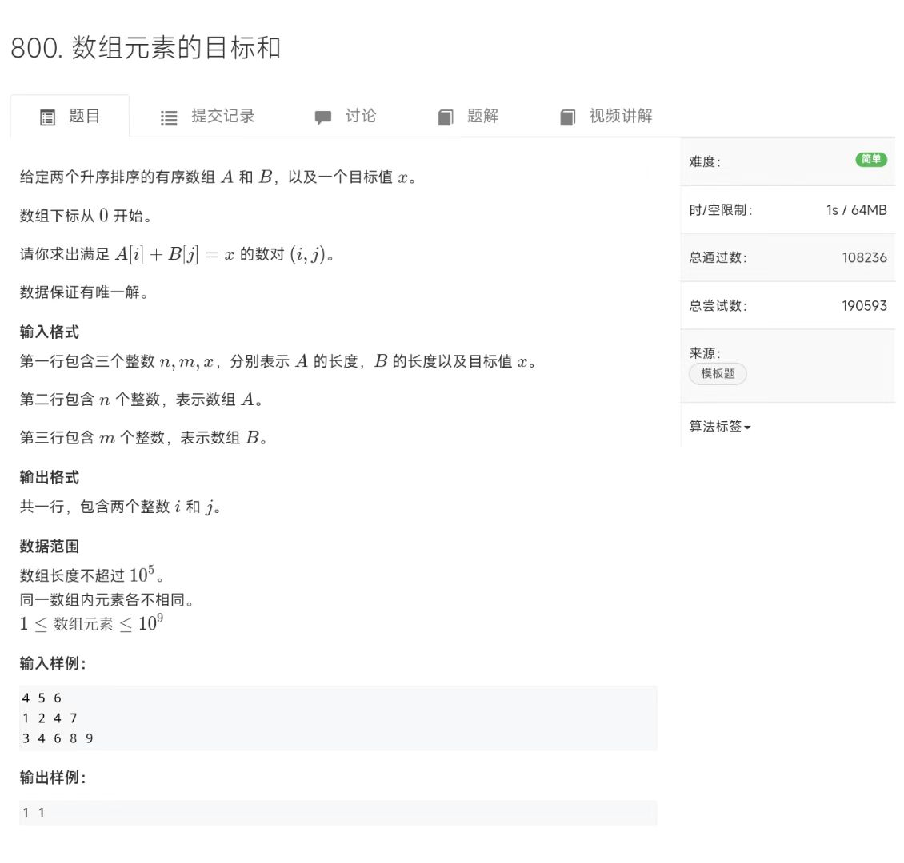
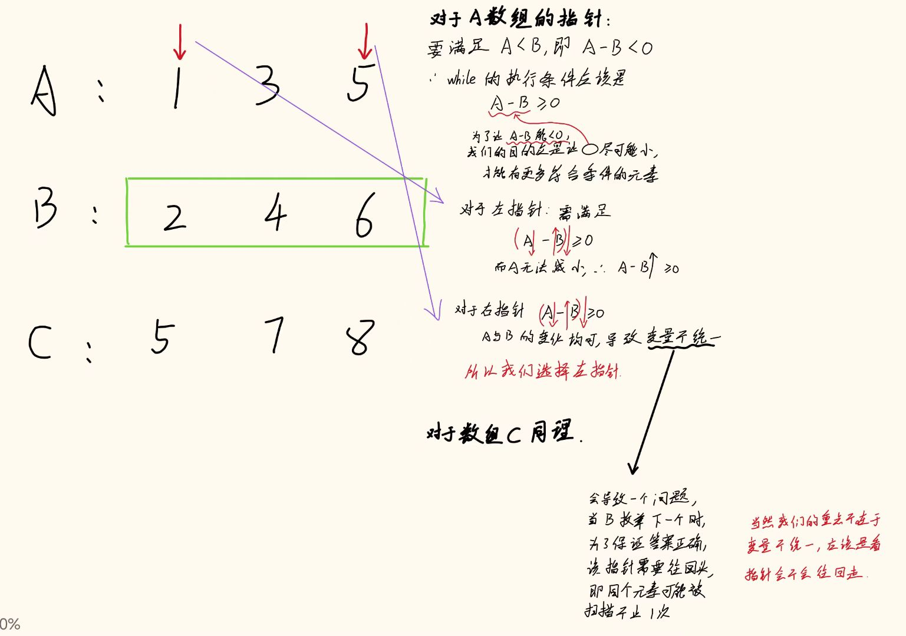
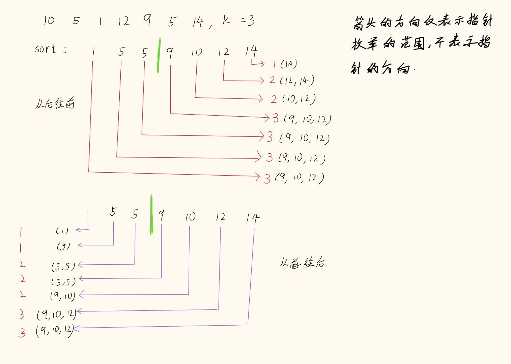

# 双指针+前缀和

前缀和还好，有板子可以套，双指针不像一个算法，应该说是一种思想、思考方式，当然是我个人的拙见。


## 数组元素的目标和

这个题是**ACWing**的，题号是800，直接截图发给在这里，没有买课的好像进不去他的**oj**里



## AC代码

这道题很容易想到暴力写法，但 O(n^2) 必然让你痛哭流涕
然后你可能想到，反正两个数组都有序了，那我遍历一个数组，**二分**另一个数组， **nlogn** ，可谓是普天同庆
当然你想的没错，也是可以过的，实现起来也不难，相信你们是手拿把掐的

那你如果问，**麦子麦子，你说的二分还是太慢了，有没有更快的解法**
**有的兄弟有的，有的**
这就要提一嘴今天我学习的**双指针**了
我们定义两个指针，一个放在 a数组 的头，一个放在 b数组 的尾，
对于每一个 a[i] ，我们都尝试在 数组b 中找一个相加和为 k 的 b[j]
如果和太大，那就让 j 向头走，
如果刚好相等，就输出答案
如果和太小，就让 i 向尾走

可以发现，不论是 i 还是 j ，都始终朝一个方向走，两个数组中的每个元素只遍历了一遍，时间复杂度是 **O(n)**

Ps:需要**特别注意**的是，数组a 中可能存在某个数 = k，这个时候在我的二分和双指针写法里会出现错误的答案，如(i,-1)
所以要做一个特判，例如规定 j >= 0,表示指针 j 一定指着某个数字

~~~cpp
//双指针
#include<iostream>

using namespace std;

const int N = 1e5+10;
int n,m,k;
int a[N],b[N];
#define read(x) scanf("%d",&x)    //看题解的时候看到的，偷学一下大佬的写法

int main(){
    read(n),read(m),read(k);
    for(int i = 0; i < n; i++)    read(a[i]);
    for(int j = 0; j < m; j++)    read(b[j]);
    
    for(int i = 0, j = m-1; i < n; i++){
        while(j >= 0 && a[i]+b[j] > k)    j--;
        if(j >= 0 && a[i]+b[j] == k)    printf("%d %d\n",i,j);
    }

    return 0;
}
~~~


~~~cpp
//二分
#include<iostream>

using namespace std;

const int N = 1e5+10;
int n,m,k;
int a[N],b[N];
#define read(x) scanf("%d",&x)

bool f(int tmp,int x){
    if(tmp + b[x] <= k)    return true;
    return false;
}

int main(){
    read(n),read(m),read(k);
    for(int i = 0; i < n; i++)    read(a[i]);
    for(int j = 0; j < m; j++)    read(b[j]);
    
    for(int i = 0; i < n; i++){
        int l = -1,r = m;
        while(l+1 < r){
            int mid = (l+r)>>1;
            if(f(a[i],mid))  l = mid;
            else    r = mid;
        }
        if(l != -1 && a[i]+b[l]==k)    printf("%d %d\n",i,l);
    }

    return 0;
}
~~~


---

## P1102 A-B 数对

**[P1102 A-B 数对 - 洛谷](https://www.luogu.com.cn/problem/P1102)**

### 题目背景

出题是一件痛苦的事情！

相同的题目看多了也会有审美疲劳，于是我舍弃了大家所熟悉的 A+B Problem，改用 A-B 了哈哈！

### 题目描述

给出一串正整数数列以及一个正整数 $C$，要求计算出所有满足 $A - B = C$ 的数对的个数（不同位置的数字一样的数对算不同的数对）。

### 输入格式

输入共两行。

第一行，两个正整数 $N,C$。

第二行，$N$ 个正整数，作为要求处理的那串数。

### 输出格式

一行，表示该串正整数中包含的满足 $A - B = C$ 的数对的个数。

### 输入输出样例 #1

#### 输入 #1

```
4 1
1 1 2 3
```

#### 输出 #1

```
3
```

#### 说明/提示

对于 $75\%$ 的数据，$1 \leq N \leq 2000$。

对于 $100\%$ 的数据，$1 \leq N \leq 2 \times 10^5$，$0 \leq a_i <2^{30}$，$1 \leq C < 2^{30}$。

2017/4/29 新添数据两组


### AC代码

这道题也可以使用双指针，先保证数组有序，然后使用两个指针分别找到满足条件的第一个和最后一个，他们之间的**差值+1**就是答案

需要注意的是，由于**while**停下来的时候，**指针在while条件最后满足的位置的下一个**，我就总是忘

~~~cpp
#include<iostream>
#include<algorithm>

using namespace std;
#define read(x) scanf("%d",&x)
#define ll long long

const int N = 2e5 + 10;
int n,c;
int a[N];

int main(){
    read(n),read(c);
    for(int i = 1; i <= n; i++)  read(a[i]);
    sort(a+1,a+n+1);
    int r1 = 1,r2 = 1;
    ll ans = 0;
    for(int i = 1; i <= n; i++){
        while(r1 <= n && a[r1]-a[i] <= c)  r1++;//找到最后一个的后一个
        while(r2 <= n && a[r2]-a[i] < c)  r2++;//找到第一个
        if(a[r2]-a[i] == c && a[r1-1]-a[i] == c)
            ans += r1-r2;
    }
    printf("%lld\n",ans);
    return 0;
}
~~~

---


## P1147 连续自然数和

**[P1147 连续自然数和 - 洛谷](https://www.luogu.com.cn/problem/P1147)**

### 题目描述

对一个给定的正整数 $M$，求出所有的连续的正整数段（每一段至少有两个数），这些连续的自然数段中的全部数之和为 $M$。

例子：$1998+1999+2000+2001+2002 = 10000$，所以从 $1998$ 到 $2002$ 的一个自然数段为 $M=10000$ 的一个解。

### 输入格式

包含一个整数的单独一行给出 $M$ 的值（$10 \le M \le 2,000,000$）。

### 输出格式

每行两个正整数，给出一个满足条件的连续正整数段中的第一个数和最后一个数，两数之间用一个空格隔开，所有输出行的第一个按从小到大的升序排列，对于给定的输入数据，保证至少有一个解。

### 输入输出样例 #1

#### 输入 #1

```
10000
```

#### 输出 #1

```
18 142 
297 328 
388 412 
1998 2002
```


### AC代码

这个嘛，可以看到需要列举的数字是有序的，那就可以像滑动窗口那样维持一个部分，这个部分如果和超过了m，那就是加多了，如果小于m，那就是加少了

**需要特别注意的是**，如果<font style color="blue">超过了m</font>，应该先减掉后面的指针i代表的数，再移动指针。

如果<font style color="blue">小于m</font>，应该先移动前面的指针j，再加上j代表的数。

~~~cpp
#include<iostream>
using namespace std;
#define read(x) scanf("%d",&x)

const int N = 2e6+10;
int m;

int main(){
    read(m);
    int sum = 3;
    for(int i = 1,j = 2; i <= m/2;){
        if(sum == m){
            printf("%d %d\n",i,j);
            sum -= i;
            i++;
        }else if(sum < m){
            j++;
            sum += j;
        }else{
            sum -= i;
            i++;
        }
    }
    
    return 0;
}
~~~

---


## P7714 「EZEC-10」排列排序

**[P7714 「EZEC-10」排列排序 - 洛谷](https://www.luogu.com.cn/problem/P7714)**

### 题目描述

给你一个长度为 $n$ 的排列 $p_1,p_2, \cdots ,p_n$。你需要把它排序。

每次可以花区间长度，即 $r-l+1$ 的代价，选择排列中的任意一段区间 $[l,r]$，并将 $[l,r]$ 从小到大排序。

现在你可以让他进行若干次这个操作，直到 $p$ 中元素的值从 $1$ 到 $n$ 按升序排序，即对于 $1$ 到 $n$ 的每一个 $i$，都有 $p_i=i$。

求问花的代价最少为多少？

### 输入格式

本题有多组询问，第一行有一个数 $T$ 表示询问组数。

对于每组询问：

第一行给出一个整数 $n$。

第二行 $n$ 个整数，由空格隔开，代表排列 $p$ 中元素的值。

### 输出格式

$T$ 行，每行一个整数表示一组询问的答案。

### 输入输出样例 #1

#### 输入 #1

```
2
3
1 3 2
4
3 2 1 4
```

#### 输出 #1

```
2
3
```

#### 说明/提示

【样例 $1$ 说明】

对于第一组数据，可选择区间 $[2,3]$ 进行排序。

对于第二组数据，可选择区间 $[1,3]$ 进行排序。

【数据规模与约定】

对于 $20\%$ 的数据，$n\leq 4$。

对于另 $30\%$ 的数据，$\sum n\leq5000$。

对于另 $10\%$ 的数据，$p_1=n$。

对于 $100\%$ 的数据，$1\le T,\sum n\le 10^6$。


### AC代码

一开始我想的是设置两个指针，框住下标和元素不相等的那一部分，然后全部加起来，看了题解发现错的很离谱。

仔细想来，我没有考虑到的是，这部分元素与下标不相等的区间，不一定都是这个区间内应该有的数字，可能会存在不是这个区间里的。

> 例如    6 1 2 
>
> ​	    1 2 6 7 5之类的
>
> 不仅无法处理只有一个不合理的区间，也无法解决上面的问题


后来我在想，如果我将**左指针i**放在第一个不合法的位置，然后用**右指针j**找到原本应该放在左指针i的元素，然后计算它的代价。不难想到，这个方案虽然可以让元素放在正确的位置，但会存在大量重复计算的区间。

所以当时在想能不能有什么贪心的优化，

如果我们把思路改变一下，**左指针i**依旧放在第一个不合法的位置，**右指针j**不断向右走，用一个mx维持左右指针框起来的区间的**最大值**，当**指针j与mx相等**时(即mx的正确位置在 j )，计算代价。

> 移动**右指针j**的循环条件为 **mx>j**,退出时 mx == j
>
> 这样的条件确保了左右指针形成的区间内元素都是原本在这个区间的


<font style color ="blue">**接下来考虑该贪心是否最优**</font>

> **1.**显然，该策略下，指针不会回退，不会出现重叠的区间。
>
> **2.**同时右指针的循环条件确保了所有元素都是框起来的区间的。
>
> **3.**在面对(3 2 1 4 7 6 5)这种有部分元素待在正确位置的情况时，不会多计算他的代价。
>
> <font style color="blue">2和3需要同时考虑</font>

~~~cpp
#include<iostream>
using namespace std;

#define read(x) scanf("%d",&x)

const int N = 1e6+10;
int a[N];
int t,n,ans = 0;

int main(){
	read(t);
	while(t--){
		ans = 0;
		read(n);
		for(int i = 1; i <= n; i++)	read(a[i]);
		
		int i = 1;
		while(i <= n){
			if(i == a[i]){
				i++;
			}else{
				int mx = a[i];
				int j = i+1;
				mx = max(mx,a[j]);//别漏了
				
				while(mx > j){
					j++;
					mx = max(mx,a[j]);
				} 
				
				ans += j-i+1;
				i = j+1;
			}
		}
		
		printf("%d\n",ans);
	}
	
	return 0;
}
~~~

---


## P8667 [蓝桥杯 2018 省 B] 递增三元组

**[蓝桥杯 2018 省 B\] 递增三元组 - 洛谷](https://www.luogu.com.cn/problem/P8667)**

给定三个整数数组 $A = [A_1, A_2,\cdots, A_N]$，$B = [B_1, B_2,\cdots, B_N]$，$C = [C_1, C_2,\cdots,C_N]$。

请你统计有多少个三元组 $(i, j, k)$ 满足：
1. $1 \le i, j, k \le N$  
2. $A_i < B_j < C_k$

### 输入格式

第一行包含一个整数 $N$。

第二行包含 $N$ 个整数 $ A_1, A_2,\cdots, A_N$。

第三行包含 $N$ 个整数 $ B_1, B_2,\cdots, B_N$。

第四行包含 $N$ 个整数 $ C_1, C_2,\cdots, C_N$。

### 输出格式

一个整数表示答案

### 输入输出样例 #1

#### 输入 #1

```
3
1 1 1
2 2 2
3 3 3
```

#### 输出 #1

```
27
```

#### 说明/提示

对于 $30\%$ 的数据，$1 \le N \le 100$。

对于 $60\%$ 的数据，$1 \le N \le 1000$。

对于 $100\%$ 的数据，$1 \le N \le 10^5$，$0 \le A_i, B_i, C_i \le 10^5$。


枚举数组a，然后在数组b中找到第一个大于a[i]的位置，再在数组c中找到第一个大于b[l1]的位置，然后计算个数。
这是原来的代码，虽说是能通过测试样例，但看了题解发现**这个思路错的离谱**，
显然在我们寻找数组b和数组c时，**没有考虑到数组b在位置l1后面可能存在大于c[l2]的元素，**所以出现了错误

~~~cpp
#include<iostream>
#include<algorithm>
#define read(x) scanf("%d",&x)

using namespace std;

const int N = 1e5+10;
int a[N],b[N],c[N];
int n;

int main(){
    read(n);
    for(int i = 1; i <= n; i++)  read(a[i]);
    for(int i = 1; i <= n; i++)  read(b[i]);
    for(int i = 1; i <= n; i++)  read(c[i]);
    sort(a+1,a+n+1);
    sort(b+1,b+n+1);
    sort(c+1,c+n+1);

    int l1 = 1, l2 = 1;
    long long ans = 0;
    for(int i = 1; i <= n; i++){
        while(a[i] >= b[l1])  l1++;
        while(b[l1] >= c[l2]) l2++;
        ans += (n-l1+1)*(n-l2+1);
    }
    printf("%d\n",ans);
    
    return 0;
}
~~~


### AC代码

**题解的思路**是，注意到数组b承上启下，所以选择**枚举数组b**
思考题目要求：A-B < 0,我们要找到尽可能多的符合条件的，即让B－A>=0这个式子的左半边尽可能小，
                     关于指针的移动方向，具体如图




同样二分也能解决，二分思路为：
在数组a中找到最后一个 < B 的元素的位置
在数组c中找到第一个 > B 的元素的位置(懒得写)

~~~cpp
#include<iostream>
#include<algorithm>
#define read(x) scanf("%d",&x)

using namespace std;

const int N = 1e5+10;
int a[N],b[N],c[N];
int n;

int main(){
    read(n);
    for(int i = 1; i <= n; i++)  read(a[i]);
    for(int i = 1; i <= n; i++)  read(b[i]);
    for(int i = 1; i <= n; i++)  read(c[i]);
    sort(a+1,a+n+1);
    sort(b+1,b+n+1);
    sort(c+1,c+n+1);

    long long ans = 0;//假设三个数组都是十万级别的，那么最后就是 1e5 * 1e5 * 1e5 = 1e15
    for(int i = 1,indexA = 1,indexC = 1; i <= n; i++){
    int B = b[i];
        while(a[indexA] < B && indexA <= n)  indexA++;
        while(c[indexC] <= B && indexC <= n) indexC++;
        ans += (long long)(indexA - 1)*(n - indexC + 1);//这里同样要考虑爆int， 1e5*1e5 = 1e10
        //给一个long long 和给两个结果一样，因为乘积运算结果会转到更高精度
    }
    printf("%lld\n",ans);//这里一定要记得写lld,排了半天不知道哪里扣了两个样例TwT
    
    return 0;
}
~~~

---


## P3143 [USACO16OPEN] Diamond Collector S

**[USACO16OPEN\] Diamond Collector S - 洛谷](https://www.luogu.com.cn/problem/P3143)**

### 题目描述

奶牛 Bessie 一直喜欢闪闪发光的物体，她最近在业余时间开始了一项爱好——挖掘钻石！她收集了 $N$ 颗大小各不相同的钻石（$N \leq 50,000$），并希望将它们中的一部分放在谷仓里的两个展示柜中展示。

由于 Bessie 希望每个展示柜中的钻石大小相对接近，她决定如果两颗钻石的大小相差超过 $K$，就不能将它们放在同一个展示柜中（如果两颗钻石的大小相差恰好为 $K$，则可以将它们一起展示在同一个展示柜中）。给定 $K$，请帮助 Bessie 确定她可以在两个展示柜中一起展示的最大钻石数量。

### 输入格式

输入文件的第一行包含 $N$ 和 $K$（$0 \leq K \leq 1,000,000,000$）。

接下来的 $N$ 行每行包含一个整数，表示一颗钻石的大小。所有钻石的大小均为正数且不超过 $1,000,000,000$。

### 输出格式

输出一个正整数，表示 Bessie 可以在两个展示柜中一起展示的最大钻石数量。

### 输入输出样例 #1

#### 输入 #1

```
7 3
10
5
1
12
9
5
14
```

#### 输出 #1

```
5
```


### AC代码

先简化问题，看看是否能求解

假设只有一个柜子，将钻石排序后，使用双指针，类似于滑动窗口那样，维持一个最长的窗口，满足新加入的元素与左指针的差值不超过K

~~~cpp
#include<iostream>
#include<algorithm>
#define read(x) scanf("%d",&x)

using namespace std;

const int N = 5e4+10;
int n,k;
int a[N];

int main(){
    read(n);read(k);
    for(int i = 1; i <= n; i++)  read(a[i]);
    sort(a+1,a+n+1);
    
    int ans = 0;
    for(int i = 1, j = 1; i <= n; i++){
        while(j <= i && a[i]-a[j]>k)  j++;
        ans = max(ans,i-j+1);
    }
     cout << ans << endl;   
    return 0;
}
~~~


那如果回到题目，我们有两个柜子呢？
通过引入一个新的指针来枚举一个分割，将数组分成左右两边，各自找最优解，和为答案
我原本的设想是两边窗口都从左往右移动，但看题解是左半边数组从左往右，右半边数组从优往左

~~~cpp
#include<iostream>
#include<algorithm>
#define read(x) scanf("%d",&x)

using namespace std;

const int N = 5e4+10;
int n,k;
int a[N];
int cnt_lr[N],cnt_rl[N];

int main(){
    read(n);read(k);
    for(int i = 1; i <= n; i++)  read(a[i]);
    sort(a+1,a+n+1);
    
    int ans = 0;
    for(int i = 1, j = 1; i <= n; i++){
        while(j <= i && a[i]-a[j]>k)  j++;
        cnt_lr[i] = max(cnt_lr[i-1],i-j+1);
    }//从头遍历
    
    for(int i = n, j = n; i >= 1; i--){
        while(j >= i && a[j]-a[i]>k)  j--;
        cnt_rl[i] = max(cnt_rl[i+1],j-i+1);
    }//从尾遍历
    
    for(int i = 1; i <= n; i++)  ans = max(ans,cnt_lr[i]+cnt_rl[i+1]);
    cout << ans << endl;   
    return 0;
}
~~~


这里放个图方便理解(画得不好请谅解)


